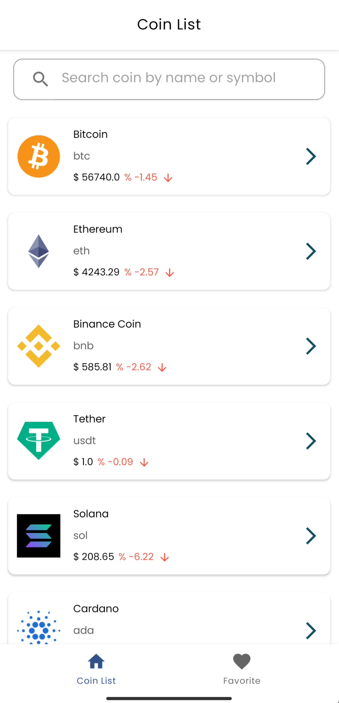
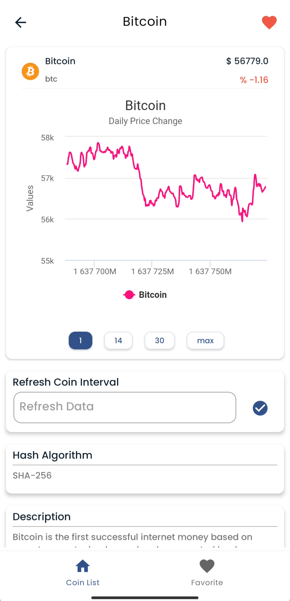
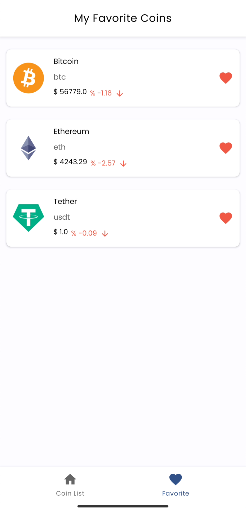

 
  <a href="https://github.com/othneildrew/Best-README-Template">
  <h1 align="center">	Coin Tracker</h1>

  
  
  
  

  
  

<!-- TABLE OF CONTENTS -->
## Table of Contents

* [About the Project](#about-the-project)
  * [Architecture](#architecture)
* [Features](#features)
* [Requirements](#requirements)
* [Contact](#contact)

  <!-- ABOUT THE PROJECT -->
## About The Project
  
Coin Tracker is a cryptocurrency tracking application. CoinGecko crypto API was used to get the latest prices and histories for coins. You can subscribe to the application using the Firebase E-mail service and view the coin list. You can create your own coin favorite list.
  
## Architecture
MVVM (Model-View-ViewModel) architecture pattern and data binding is used in the development of this application. The development language of the application is Kotlin.

* Architecture;
    * [Data Binding](https://developer.android.com/topic/libraries/data-binding/)
    * [View Binding](https://developer.android.com/topic/libraries/view-binding)
    * [ViewModel](https://developer.android.com/topic/libraries/architecture/viewmodel)
    * [Hilt](https://developer.android.com/training/dependency-injection/hilt-android) 
    * [Navigation](https://developer.android.com/guide/navigation)
    * [DataStore](https://developer.android.com/topic/libraries/architecture/datastore)

* Third parties;
    * [Kotlin Coroutines (Kotlin flows)](https://developer.android.com/kotlin/flow)
    * [Flow](https://developer.android.com/kotlin/flow)
    * [Room](https://developer.android.com/training/data-storage/room)
    * [Gson](https://github.com/google/gson)
    * [Retrofit](https://github.com/square/retrofit)
    * [MPAndroidChart](https://github.com/AAChartModel/AAChartCore-Kotlin)
    * [Glide](https://bumptech.github.io/glide/) 
    * [Firebase](https://firebase.google.com)
    * [Firebase Auth](https://firebase.google.com/docs/auth)
    * [Cloud Firestore](https://pub.dev/packages/cloud_firestore)
    * [Lottie](https://github.com/airbnb/lottie-android)
  
## Features
  - Users can sign up by e-mail. You can save your own coins.
  - The user can view all coins information; such as name, symbol, current price, price change percentage 24h, etc.
  - Users can view selected coin details Hash algorithm information, explanation, time interval change with a graphical table. On the detail page, the users can add or remove the coin to their favorites.
  - The user can search by coin name and symbol by coin id on the home page.
  - When the application and coin detail page is opened, the user's favorite coin information is updated.
  - The user can update the information of the coin viewed between certain minutes.
 

## Requirements
  - First, make sure you have Android Arctic Fox 3.1 version installed
  - Android Studio's Gradle JDK version should be Java 11.0.10.
  
--
<!-- CONTACT -->
## Contact

- [Linkedin](https://www.linkedin.com/in/mertcantoptas/)
- [Twitter](https://twitter.com/Merttoptas)
- [Medium](https://medium.com/@merttoptas34)
- [Personal Web Site](https://merttoptas.com)
